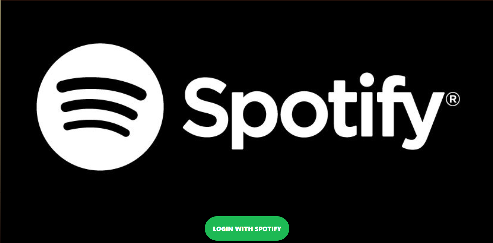
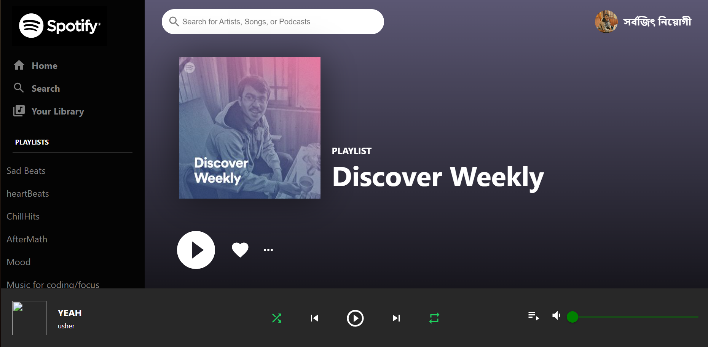

# Spotify Clone Web app

 
 
# 1. Tech

- Front-End
   

  &nbsp;
  &nbsp;
  

- Back-End
   

  &nbsp;
  &nbsp;
  

- Deploy
   

  &nbsp;
  

- Edit Tool
   

  &nbsp;
  &nbsp;
  

- Used Cryptocurrency | Wallet
   

  &nbsp;
  

  

# 2. 프로젝트 상세 내용

| Main (Not connected)                                       |
| ---------------------------------------------------------- |
|  |

 

| Connect Account                                   |
| ------------------------------------------------- |
|  |

 

| Create Campaign                                          |
| -------------------------------------------------------- |
|  |

 

| My Campaign / Campaign Detail                              |
| ---------------------------------------------------------- |
|  |

 

| Donate                                           |
| ------------------------------------------------ |
|  |

 

| Main (Tablet)                                   |
| ----------------------------------------------- |
|  |

 

| Create Campaign (Tablet)                                  |
| --------------------------------------------------------- |
|  |

 

| Main (Mobile) / Create Campaign (Mobile)                                                                                               |
| -------------------------------------------------------------------------------------------------------------------------------------- |
| &nbsp;&nbsp;&nbsp;&nbsp; |

